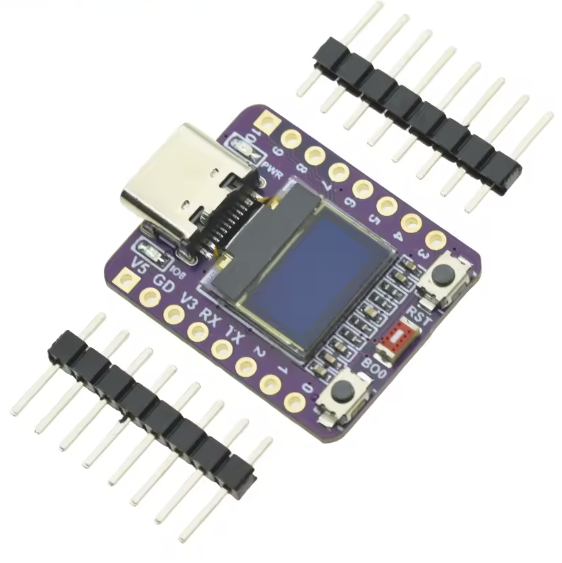

# ESP32-C3 OLED Demo

A little demo project showcasing various display tests and patterns on an
ESP32-C3 development board with a 0.42 inch OLED display attached to the baord.

<table>
<tr>
<td></td>
<td></td>
</tr>
</table>

## Hardware Requirements

- ESP32-C3 Development Board with onboard 0.42" OLED display (72x40 pixels)
- The OLED uses SH1106 driver and is connected via I2C on pins GPIO5 (SDA) and
  GPIO6 (SCL)

## Features

This demo includes 9 different display tests that cycle every 2 seconds:

1. **Pixel Test** - Shows pixel addressing with crosshairs and coordinate info
2. **Border Test** - Full border with corner markers and dimension display
3. **Pattern Test** - Checkerboard pattern with inverted text overlay
4. **Scroll Test** - Animated scrolling text with moving indicator
5. **Bar Graph** - Animated sine wave bar chart
6. **Shapes Test** - Expanding circle animation with triangles
7. **Line Pattern** - Moving diagonal and vertical line animations
8. **Gradient Test** - Dithered gradient effect using pixel patterns
9. **QR Code** - Links to this GitHub repository (scannable with QR apps)

## Pre-built Firmware

**Just want to try the demo?** Flash the pre-built firmware without any
development setup:

### Option 1: Using esptool.py

```bash
# Install esptool
pip install esptool

# Flash the firmware (replace /dev/ttyUSB0 with your port)
esptool.py --chip esp32c3 --port /dev/ttyUSB0 --baud 460800 write_flash 0x10000 firmware.bin

# On macOS, port might be something like /dev/cu.usbmodem1101
# On Windows, port might be COM3, COM4, etc.
```

### Option 2: Using Web-based ESP32 Flasher

You can use online ESP32 flashing tools that work directly in Chrome/Edge
browsers:

- **ESP Web Tools**:
  [https://esphome.github.io/esp-web-tools/](https://esphome.github.io/esp-web-tools/)
- **ESP Tool Online**:
  [https://espressif.github.io/esptool-js/](https://espressif.github.io/esptool-js/)

1. **Download firmware.bin** from
   [Releases](https://github.com/Pharkie/ESP32-C3-OLED-Demo/releases)
2. **Open web flasher** in Chrome or Edge browser
3. **Connect ESP32-C3** via USB
4. **Select firmware.bin** and flash at address `0x10000`

_Note: Requires Chrome/Edge browser with Web Serial API support_

### Option 3: Using ESP32 Flash Download Tool

1. **Download firmware**: Get `firmware.bin` from
   [Releases](https://github.com/Pharkie/ESP32-C3-OLED-Demo/releases)
2. **Install ESP32 Flash Tool**: Download from
   [Espressif](https://www.espressif.com/en/support/download/other-tools)
3. **Flash settings**:
   - **Chip Type**: ESP32-C3
   - **firmware.bin** at address `0x10000`
   - **Boot Mode**: UART
   - **Flash Size**: 4MB
4. **Connect ESP32-C3** via USB and click "START"

## Development Setup (PlatformIO)

**Want to modify the code or build from source?** This project uses PlatformIO
for development.

### Required Libraries (Auto-installed):

1. **Adafruit SH110X** - SH1106 OLED display driver (works better than SSD1306)
2. **Adafruit GFX Library** - Graphics library for drawing functions
3. **QRCode** - QR code generation library
4. **Wire** - Built-in I2C library

### Setup Steps:

1. Make sure you have PlatformIO extension installed in VS Code
2. Open this folder in VS Code
3. PlatformIO will automatically install dependencies
4. Build and upload using PlatformIO commands

### PlatformIO Commands:

- **Build**: `pio run`
- **Upload**: `pio run --target upload`
- **Serial Monitor**: `pio device monitor`
- **Clean**: `pio run --target clean`

## Code Structure Overview

- **Main Program**: `main.cpp` - Setup, loop, and test coordination
- **Configuration**: `config.h` - All hardware settings and constants
- **Display Helpers**: `display_helpers.cpp` - Offset-aware drawing functions
- **Individual Tests**: Each test pattern in its own `.cpp` file for modularity

## Code Structure Detail

The code is organized into modular files for maintainability:

```
├── include/
│   ├── config.h           # Hardware configuration and constants
│   ├── display_helpers.h  # Helper function declarations
│   └── display_tests.h    # Test function declarations
├── src/
│   ├── main.cpp          # Main program logic
│   ├── display_helpers.cpp # Abstracted display functions
│   ├── test_pixel.cpp    # Pixel addressing test
│   ├── test_border.cpp   # Border test
│   ├── test_pattern.cpp  # Pattern test
│   ├── test_scroll.cpp   # Scrolling text test
│   ├── test_bargraph.cpp # Bar graph animation
│   ├── test_shapes.cpp   # Circle and shapes test
│   ├── test_lines.cpp    # Line pattern animations
│   ├── test_gradient.cpp # Gradient dithering test
│   └── test_qrcode.cpp   # QR code generation
└── platformio.ini        # Project configuration
```

## Pin Configuration

The project is configured for the specific ESP32-C3 OLED board pinout:

- **SDA (Data)**: GPIO5
- **SCL (Clock)**: GPIO6
- **LED**: GPIO8 (onboard LED for error indication)
- **OLED Address**: 0x3C (standard for SH1106 displays)
- **Display Size**: 72x40 pixels (declared as 128x64 with offset for
  compatibility)

The display uses a calibrated offset (X=26, Y=24) to properly center content on
the 72x40 screen.

If your board uses different pins, modify these values in `include/config.h`:

```cpp
#define SDA_PIN 5
#define SCL_PIN 6
#define SCREEN_OFFSET_X 26
#define SCREEN_OFFSET_Y 24
```

## QR Code Feature

The QR code test generates a scannable code linking to this GitHub repository:

- **Version 4** QR code (33x33 modules)
- **ECC_MEDIUM** error correction for reliable scanning
- **4-pixel quiet zone** for proper QR standard compliance
- **Black on white** background for better phone camera recognition

**Scanning Tips:**

- Use dedicated QR scanner apps rather than iPhone camera
- Turn OFF macro mode for better recognition
- Hold phone 8-12 inches away with good lighting

## Build instructions

If you want to modify the code or build from source:

1. **Open in VS Code with PlatformIO**:

   - Make sure PlatformIO extension is installed
   - Open this project folder in VS Code
   - PlatformIO will detect the `platformio.ini` file

2. **Build the project**:

   - Use Ctrl+Shift+P (Cmd+Shift+P on Mac) → "PlatformIO: Build"
   - Or click the checkmark icon in the PlatformIO toolbar

3. **Upload to ESP32-C3**:

   - Connect your ESP32-C3 board via USB
   - Use Ctrl+Shift+P → "PlatformIO: Upload"
   - Or click the arrow icon in the PlatformIO toolbar

4. **Monitor Serial Output**:
   - Use Ctrl+Shift+P → "PlatformIO: Serial Monitor"
   - Or click the plug icon in the PlatformIO toolbar
   - Baud rate is set to 115200

## Troubleshooting

### OLED Not Working:

- Check I2C connections (SDA=GPIO5, SCL=GPIO6)
- Verify OLED address (this project uses 0x3C for SH1106)
- Ensure proper power supply to the OLED
- Check Serial Monitor for initialization messages
- LED will blink if OLED initialization fails

### Display Issues:

- **Offset problems**: Adjust `SCREEN_OFFSET_X` and `SCREEN_OFFSET_Y` in
  `config.h`
- **Wrong driver**: This project uses SH1106, not SSD1306
- **Size mismatch**: Display is 72x40 but declared as 128x64 for library
  compatibility

### QR Code Scanning Issues:

- **iPhone camera**: May not auto-detect small QR codes, use dedicated QR apps
- **Distance**: Hold phone 8-12 inches away
- **Lighting**: Ensure good lighting on the display
- **Macro mode**: Turn OFF macro mode for better recognition

## Common Display Addresses:

- `0x3C` - Most common for SH1106 displays (used in this project)
- `0x3D` - Alternative address for some displays

## Pin Variations:

Some ESP32-C3 boards may use different I2C pins:

- GPIO4 (SDA), GPIO5 (SCL)
- GPIO8 (SDA), GPIO9 (SCL)
- GPIO21 (SDA), GPIO22 (SCL)

Check your board's documentation and update `config.h` accordingly.

## Customization

### To display only QR code:

Uncomment the QR code lines in `main.cpp` loop() function:

```cpp
// Just display QR code (comment out cycling for testing)
displayQRCode();
delay(100);
```

### To add new test patterns:

1. Create new test file: `src/test_mytest.cpp`
2. Add function declaration to `include/display_tests.h`
3. Add case to switch statement in `main.cpp`
4. Update test count in loop logic

### To modify display offset:

Adjust values in `include/config.h`:

```cpp
#define SCREEN_OFFSET_X 26  // Horizontal offset
#define SCREEN_OFFSET_Y 24  // Vertical offset
```

## License

This project is licensed under the MIT License - see the [LICENSE](LICENSE) file
for details.

## Next Steps

Try modifying the code to:

- Add sensor readings display
- Create custom animations
- Implement menu systems
- Add Wi-Fi status indicators
- Display real-time data
- Create interactive demos using the boot button
